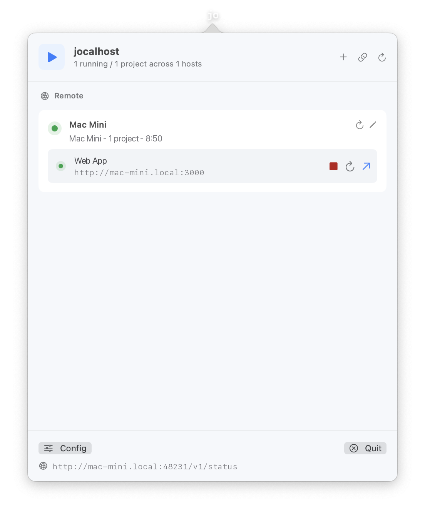
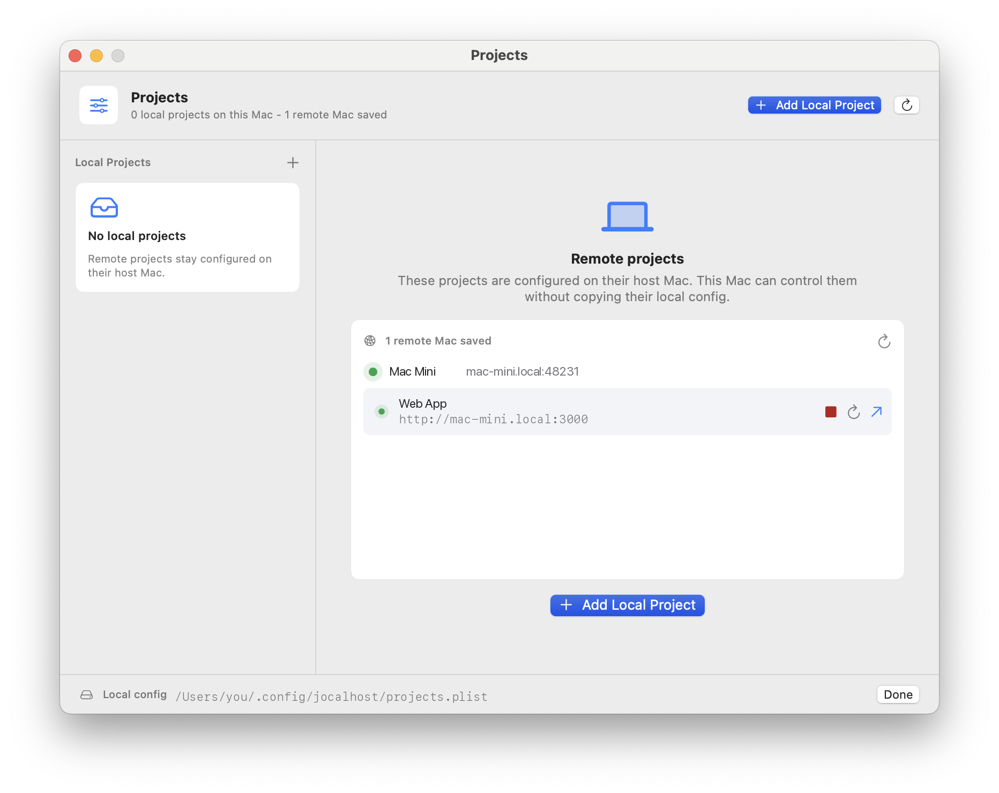

# jocalhost

jocalhost is a native macOS menu bar app for one very specific modern dev problem: `localhost` stops being obvious once your coding workflow spans multiple machines and AI agents.

It started with a Mac Mini doing the actual development work, a MacBook acting as the roaming control surface, and Codex needing a reliable way to know which preview URL is real. The dev server might run on the Mac Mini, but the browser might open on the MacBook. In that world, `http://localhost:3000` is usually the wrong answer.

jocalhost makes the host Mac explicit. It supervises local dev servers, exposes the LAN URL, and lets another Mac inspect or control those runs without pretending both computers share the same `localhost`.

<table>
  <tr>
    <td width="50%">
      
    </td>
    <td width="50%">
      
    </td>
  </tr>
</table>

Status: alpha. jocalhost is source-buildable and useful for local/LAN workflows, but public signed releases, notarization, auto-update, and hosted preview tunnels are not shipped yet.

## Why This Exists

AI coding workflows made preview state messy:

- a dev server is running somewhere, but not necessarily on the machine in your hands
- an agent can start a server, but the user still needs the right browser URL
- `localhost` means different things to the host Mac, the client Mac, and a remote control tool
- menu bar state is faster than digging through terminal tabs

jocalhost is the small local boundary for that mess: one app owns the dev-server process, one status endpoint describes it, and every client uses the host's `networkURL` when it needs to open the preview.

## What It Does

- Starts, stops, restarts, and opens configured dev servers.
- Shows project status, PIDs, ports, local URLs, and LAN URLs from the macOS menu bar.
- Treats configured ports as preferred ports and follows the actual listening port when a dev server falls back.
- Stores config in `~/.config/jocalhost/projects.plist`.
- Exposes a token-protected LAN status/control endpoint so another Mac can control the host Mac without confusing its own `localhost` with the host's `localhost`.
- Provides `jocalhostctl` for CLI control and `jocalhost-mcp` for agent/MCP workflows.
- Builds as a native SwiftUI/AppKit app. No Electron, no Tauri.

## Requirements

- macOS 14 or newer
- Swift 6.1 or newer
- Xcode Command Line Tools

## Build

```sh
swift build
swift test
swift run jocalhost-checks
```

Run from source:

```sh
swift run jocalhost
```

Build the app bundle and CLI tools:

```sh
./scripts/build-app.sh
open dist.noindex/jocalhost.app
```

Install the app locally:

```sh
./scripts/install-app.sh
open /Applications/jocalhost.app
```

For Developer ID signing:

```sh
CODE_SIGN_IDENTITY="Developer ID Application: Your Name (TEAMID)" ./scripts/build-app.sh
```

Development builds are ad-hoc signed with a stable designated requirement for the bundle identifier. This keeps macOS privacy grants more stable across local rebuilds, but public distribution still needs proper Developer ID signing and notarization.

## CLI

The app listens on a per-user Unix domain socket:

```txt
~/.local/share/jocalhost/control.sock
```

Use the bundled CLI to control the running menu bar app:

```sh
./dist/jocalhostctl ping
./dist/jocalhostctl list
./dist/jocalhostctl reload
./dist/jocalhostctl start "My App"
./dist/jocalhostctl stop "My App"
./dist/jocalhostctl restart "My App"
./dist/jocalhostctl open "My App"
./dist/jocalhostctl --json status
./dist/jocalhostctl lan-info
```

## Remote Mac Setup

One Mac hosts the dev server. Another Mac can save that host and use its real LAN preview URLs.

On the host Mac, open jocalhost and copy the remote setup command from the LAN footer. From Terminal, the same command is available with:

```sh
./dist/jocalhostctl lan-info
```

Run the copied command on the client Mac:

```sh
jocalhostctl remote-add 'Mac Mini' '192.168.1.23' --token '<token>' --port 48231
```

Open jocalhost on the client Mac. The host appears under Remote, and preview links use `networkURL` instead of the host's `localhost`.

Advanced: the LAN control endpoint listens on port `48231` by default. Override it with `JOCALHOST_LAN_PORT=48232`. Saved remote hosts live in `~/.config/jocalhost/remote-hosts.plist`.

If a hosted project lives under protected macOS folders such as `~/Documents`, give `jocalhost.app` Full Disk Access on the host Mac.

## MCP Server

`jocalhost-mcp` is a minimal stdio MCP server. It exposes the running menu bar app and saved remote hosts as tools:

- `list_projects`
- `get_status`
- `reload_projects`
- `add_project`
- `start_project`
- `stop_project`
- `restart_project`
- `open_project`
- `get_config_path`

`add_project` registers a local workspace and can detect the project name, dev command, and port from `package.json`.

Example client config:

```json
{
  "mcpServers": {
    "jocalhost": {
      "command": "/absolute/path/to/jocalhost-mcp"
    }
  }
}
```

Tool summaries prefer `networkURL` and omit `localhost` preview links, so remote-device Codex sessions do not hand users a URL that only works on the host Mac.

### Codex App

jocalhost does not install Codex automatically. If the Codex CLI is available, run:

```sh
codex app
```

That opens the Codex desktop app when it is installed, or starts the installer when it is missing. Install the jocalhost Codex plugin from the Codex plugin directory, then start a new thread and type `Jocalhost`. The plugin uses `jocalhost-mcp`, including `add_project`, to register and start the current workspace when needed.

## Example Project Config

```xml
<?xml version="1.0" encoding="UTF-8"?>
<!DOCTYPE plist PUBLIC "-//Apple//DTD PLIST 1.0//EN" "http://www.apple.com/DTDs/PropertyList-1.0.dtd">
<plist version="1.0">
<array>
  <dict>
    <key>command</key>
    <string>npm run dev</string>
    <key>id</key>
    <string>2EE55378-F944-4C6C-9C21-A9C1D919D4B3</string>
    <key>name</key>
    <string>My App</string>
    <key>port</key>
    <integer>3000</integer>
    <key>exposeOnLocalNetwork</key>
    <true/>
    <key>workingDirectory</key>
    <string>/Users/you/Projects/my-app</string>
  </dict>
</array>
</plist>
```

`port` is optional and means preferred port. If the managed dev server opens a different port, jocalhost shows and opens the detected runtime URL.

## Security

LAN control is intended for trusted local networks. See [SECURITY.md](SECURITY.md) before exposing anything beyond your own machine or LAN.

## Docs

- [Vision](Docs/Vision.md)
- [Development distribution](Docs/Distribution.md)

## License

MIT. See [LICENSE](LICENSE).
